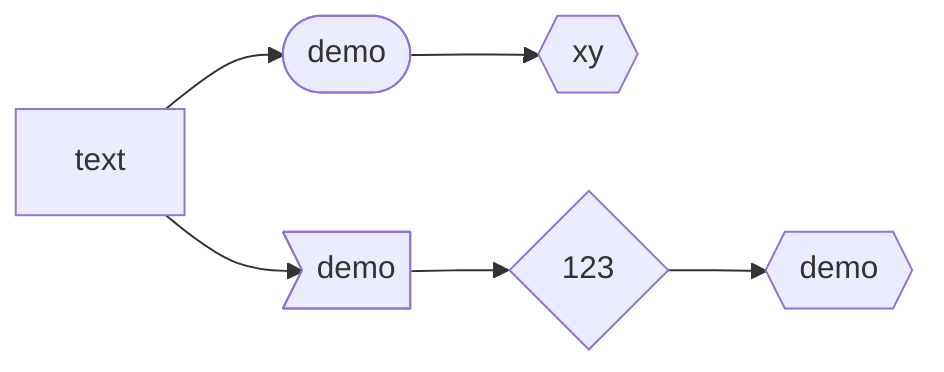
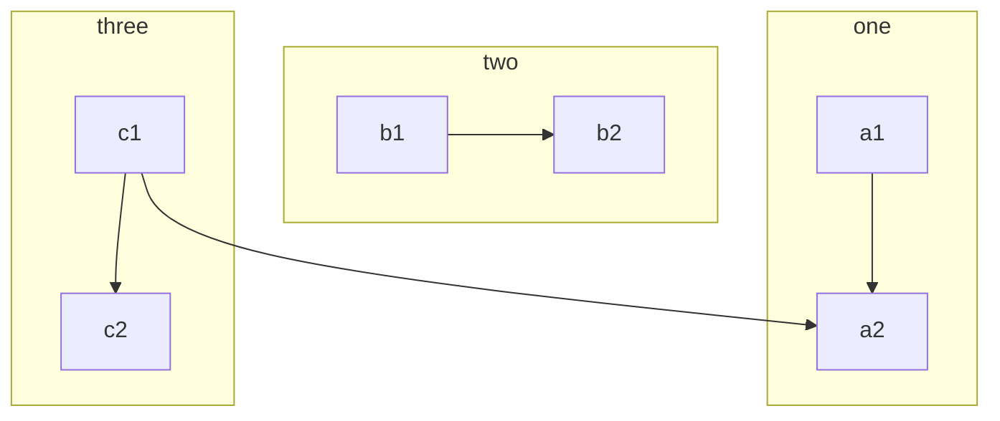
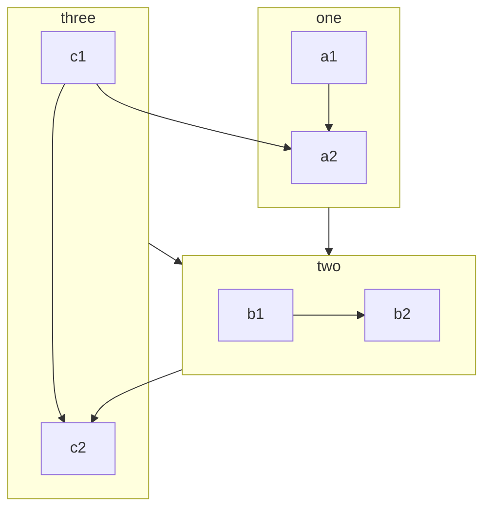
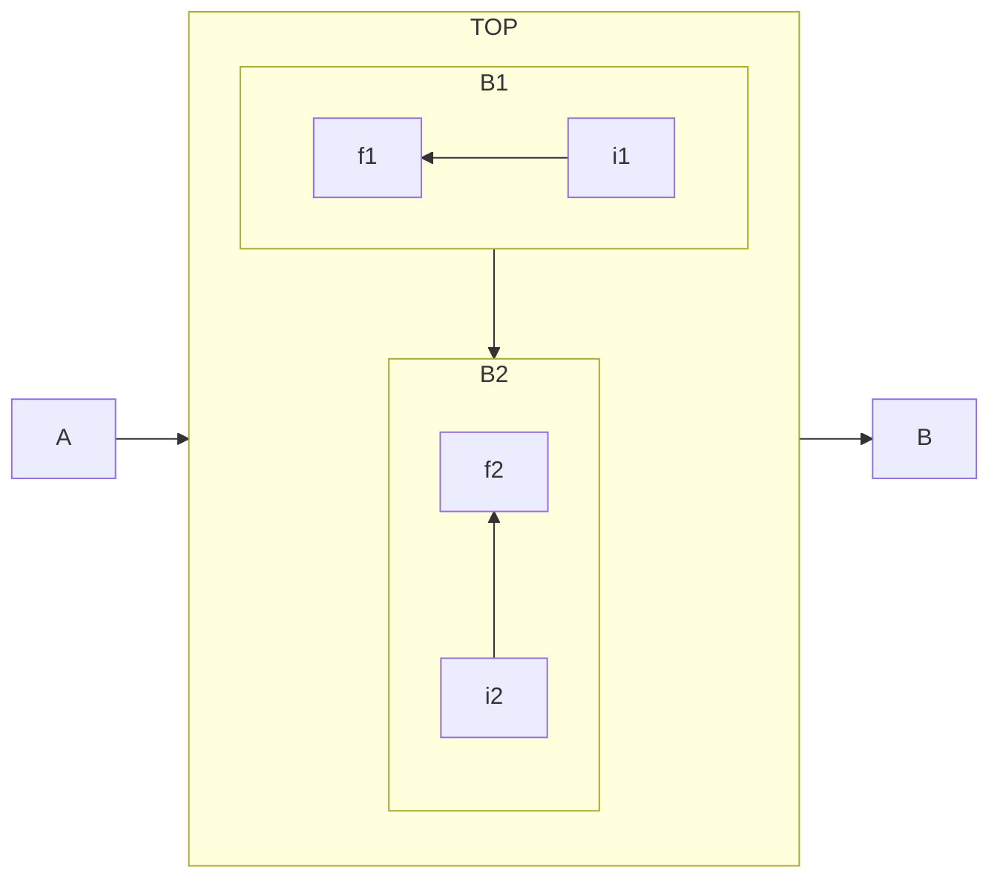
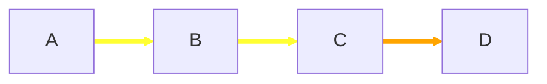
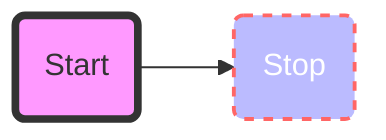
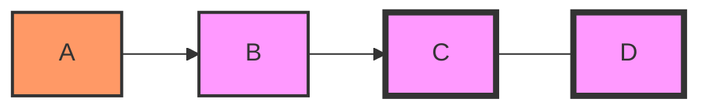
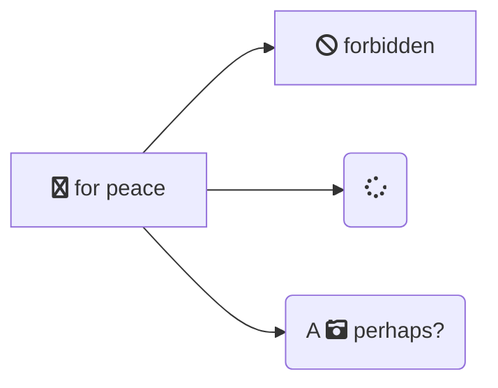
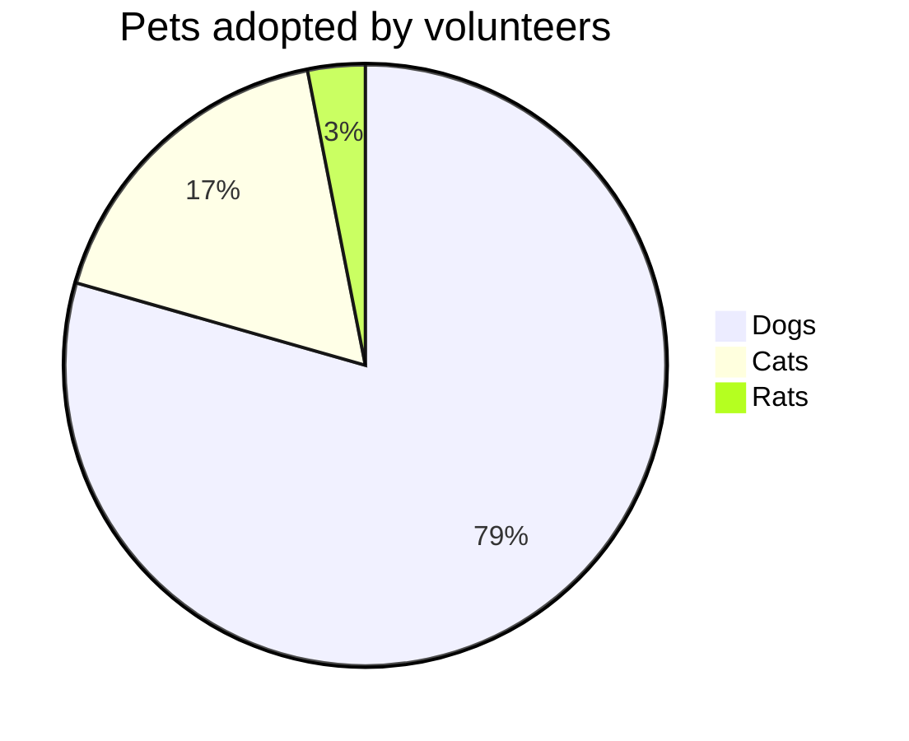
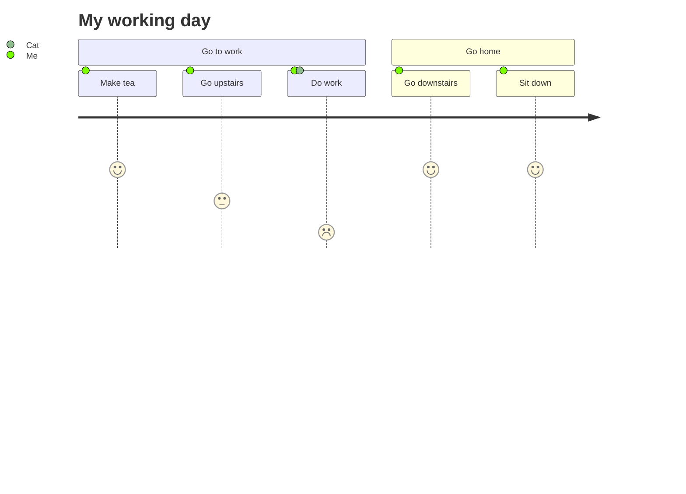

=== "Memaid"
	``` mermaid
	graph LR
	  A[Start] --> B{Error?};
	  B -->|Yes| C[Hmm...];
	  C --> D[Debug];
	  D --> B;
	  B ---->|No| E[Yay!];
	```
=== "source"
	```
	graph LR
	  A[Start] --> B{Error?};
	  B -->|Yes| C[Hmm...];
	  C --> D[Debug];
	  D --> B;
	  B ---->|No| E[Yay!];
	```
	
===! "source"
	test
	```
	code
	```
	
	

[Online FlowChart & Diagrams Editor - Mermaid Live Editor](https://mermaid-js.github.io/mermaid-live-editor)

# Flowchart

```ad-gray
- **nodes**
- the geometric shapes 
- **edges**
- the arrows or lines.

```

```
flowchart LR  
	 id[This is the text in the box]  
	 没有空格
	 可以放在引号内
```




## Node
- 方向
	- TD/TB
	- BT
	- LR
	- RL
```ad-mypurple
title: shape

- `[]`
- `()`
- `([])` stadium-shaped
- `[[]]`
- `[()]` cylindrical / datebase 
- `(())`
- `>]`
- `{}` rhombus
- `{{}}` hexagon
- `[//]` Parallelogram
- `[\\]` Parallelogram
- `[/\]`
- `[\/]`
```

## links
```ad-mypurple
title: links

- `-->` and `-->|text|` and `-- text -->`
- `---` and `---|text|` and `--text---`  
- dotted 
	```
	-.->
	-.text.-> 
	```
- thick
	```
	==>
	==text==>
	```
- multiple nodes links
	```
	a-->b&c-->d
	A&B-->C&D
	```
	
- new types
	```
	--o
	--x
	<-->
	x--x
	```
- `---->` 长度代表rank

```

## subgraphs
- basic 


- set edges to and from subgraphs


- directions in subgraph


## styling
```ad-mypurple
title: styling links

- linkstyle index ...
- stroke
	- `#ff3`
	-  


```



```ad-mypurple
title: styling nodes

- style id ...
- fill
- stroke
- stroke-width
- stroke-dasharray
```



```ad-mypurple
title: classes

-  define a class of styles and attach this class to the nodes
	- `classDef className fill:#f9f,stroke:#333,stroke-width:4px;`
-  attach node to class
	- `class nodeId1,nodeId2 className;`
- shorter form `:::`
	- `A:::someclass --> B`
- CSS classes
- default class
	- `classDef default fill:#f9f,stroke:#333,stroke-width:4px;`
```



## Others
- Interaction*fun*
```
flowchart LR
	A-->B
	B-->C
	C-->D
	click A callback "Tooltip for a callback"
	click B "http://www.github.com" "This is a tooltip for a link"
	click A call callback() "Tooltip for a callback"
	click B href "http://www.github.com" "This is a tooltip for a link"
```
- comments
```
%% this is a comment A -- text --> B{node}
```
- fontawesome
	- fa:fa-twitter
	- fa:fa-spinner
	- fa:fa-ban
	- fa:fa-camera-retro

- 顶点和链接之间允许有一个空格。但是，顶点及其文本与链接及其文本之间不应有任何空格。

# Class diagram
# ER
# Others
## Sequence diagram
## Gantt diagram
## Pie

## User Journey

#TD [[JavaScript]]